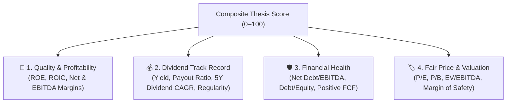

# TradingDash

[](https://www.python.org/downloads/)
[](https://share.streamlit.io)
[](./LICENSE)
[](https://github.com/dyegomiranda/Trading-Dash/releases)

A modern, educational **Streamlit** dashboard designed for Brazilian stock market (B3) investors following the **Quality Dividend** strategy. Build paper portfolios, explore 4-pillar thesis scoring, project passive dividend income with live inflation adjustments, and backtest historical performance with institutional-grade risk models.

> ⚠️ **Educational & Paper Trading Tool:** This project is for research and study purposes only. **It does not constitute investment advice or buy/sell recommendations.**

---

## 🌟 Key Features

| Page / Feature | Description |
|---|---|
| **🏠 Home (Início)** | High-level portfolio overview, live B3 market news radar, and real-time **Economic Status (Regime Macro)** with official Central Bank (BCB) Selic & 12-month IPCA data. |
| **🔍 Discover Stocks (Descubra ações)** | Comprehensive 0–100 scoring across the 4 thesis pillars, sector distributions, suggested weights, and interactive historical price charts. |
| **💼 My Portfolio (Minha carteira)** | Paper portfolio tracker with thesis-driven allocation, automatic ON/PN share deduplication, detailed expandable stock cards (Quality, Dividends, Financial Health, Valuation), and live inflation-adjusted passive income projections. |
| **⏳ Historical Testing (Teste no passado)** | Realistic backtesting engine from 2020–present featuring dynamic slippage, brokerage costs, cash dividend lags, Monte Carlo confidence intervals, stress scenarios, and **Nominal vs. Real Return (IPCA)** metrics. |
| **📖 Beginner's Guide (Guia do iniciante)** | Clear glossary, thesis rules, indicator definitions, and practical steps for long-term dividend investing. |
| **⚙️ Settings (Configurações)** | Yahoo Finance vs experimental Brapi, custom macro tilts, and cache management. Paper money only — no synthetic “demo” market in the UI. |

---

## 🏛️ The 4-Pillar Quality Dividend Thesis

TradingDash evaluates every publicly traded company on B3 across four fundamental pillars:



- **Core Holdings (~70%):** Mature, cash-generative companies with proven dividend history, high barriers to entry, and low debt (e.g., Electric Utilities, Sanitation, Insurance, Major Banks).
- **Satellite Holdings (~30%):** Resilient businesses with attractive valuations and strong growth potential.

---

## 🚀 Quick Start

### 1. Run Locally with Python

```bash
# Clone repository
git clone https://github.com/dyegomiranda/Trading-Dash.git
cd Trading-Dash

# Create and activate virtual environment
python3 -m venv .venv
source .venv/bin/activate  # On Windows: .venv\Scripts\activate

# Install dependencies
pip install -r requirements.txt

# Launch application
streamlit run app.py
```

Then open `http://localhost:8501` in your browser.

---

### 2. Standalone Desktop Binaries (No Python Required)

Pre-built standalone executables are available on the [Releases](https://github.com/dyegomiranda/Trading-Dash/releases) page for each release tag (e.g. `v0.3`):

| Operating System | Binary Package | How to Run |
|---|---|---|
| **🐧 Linux** | `TradingDash-x86_64.AppImage` | Make executable (`chmod +x TradingDash-x86_64.AppImage`) and double-click or run from terminal. |
| **🪟 Windows** | `TradingDash-windows.zip` | Extract the zip file and run `TradingDash.exe`. |

*Note: All portfolio data and local preferences remain securely stored on your local machine (`~/.local/share/TradingDash/` on Linux, `%APPDATA%\TradingDash\` on Windows).*

---

### 3. Deploy to Streamlit Community Cloud

1. Fork or push this repository to your GitHub account.
2. Visit [share.streamlit.io](https://share.streamlit.io) and log in with GitHub.
3. Click **New app** → Select your repository (`TradingDash`) and `main` branch.
4. Set **Main file path** to `app.py`.
5. *(Optional)* Add API secrets under **Settings → Secrets** (`BRAPI_TOKEN` for premium B3 feeds, `XAI_API_KEY` for AI assistant).
6. Click **Deploy!**

---

## 📈 Macroeconomic Regime & Inflation Adjustments

TradingDash integrates official Central Bank of Brazil (BCB SGS API) macroeconomic data to give users realistic projections:

- **Economic Regimes:**
  - 🔴 **Restrictive (High Real Interest Rates):** Defensive allocation favoring zero/low-debt utilities and high-margin cash cows.
  - 🟡 **Cautious / Transition:** Balanced core & satellite positioning.
  - 🟢 **Expansionary (Low Interest Rates):** Quality cyclical businesses and reinvestment opportunities.
- **Inflation Real Returns:** All forward-looking income estimates and historical backtest results calculate both **Nominal Value** and **Real Purchasing Power Adjusted by Official IPCA**.

---

## 📁 Repository Structure

```
TradingDash/
├── app.py                      # Main entrypoint and navigation
├── app_pages/                  # Modular Streamlit application views
│   ├── inicio.py               # Home dashboard & Macroeconomic Status
│   ├── descobrir_acoes.py      # Stock screening & 4-pillar analysis
│   ├── minha_carteira.py       # Portfolio builder & expandable stock cards
│   ├── teste_no_passado.py     # Backtesting engine & inflation metrics
│   ├── guia_iniciante.py       # Beginner documentation & glossary
│   └── configuracoes.py        # System and data provider settings
├── src/                        # Core engine & business logic
│   ├── thesis/                 # Scoring algorithms, filters & macro models
│   ├── data/                   # Data providers (Yahoo, Brapi, Demo, BCB)
│   ├── portfolio/              # Paper portfolio state & trade executions
│   ├── backtest/               # Quantitative simulation & risk analysis
│   └── ui/                     # UI themes, components & interactive cards
├── packaging/                  # PyInstaller spec and AppImage configurations
├── tests/                      # Automated test suite (Pytest)
└── data/                       # Reference metadata, caches & local portfolios
```

---

## 🧪 Testing & Code Quality

Run the test suite and linter locally:

```bash
# Run all automated tests
PYTHONPATH=. pytest tests/

# Run code linter
ruff check app_pages/ src/ tests/
```

---

## 📄 License
 
This project is open source and available under the [GNU General Public License v3.0 (GPL-3.0)](./LICENSE).
